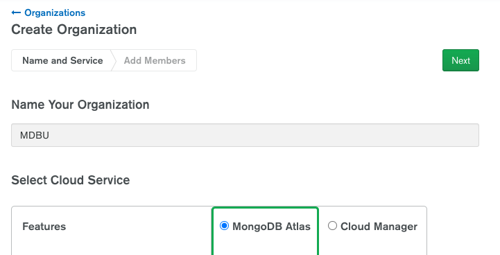
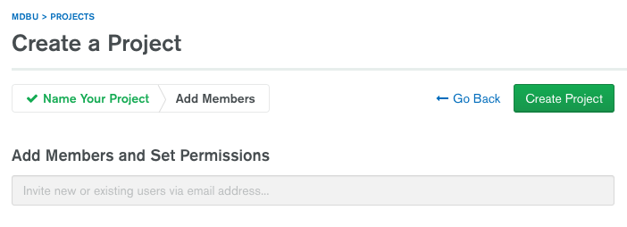
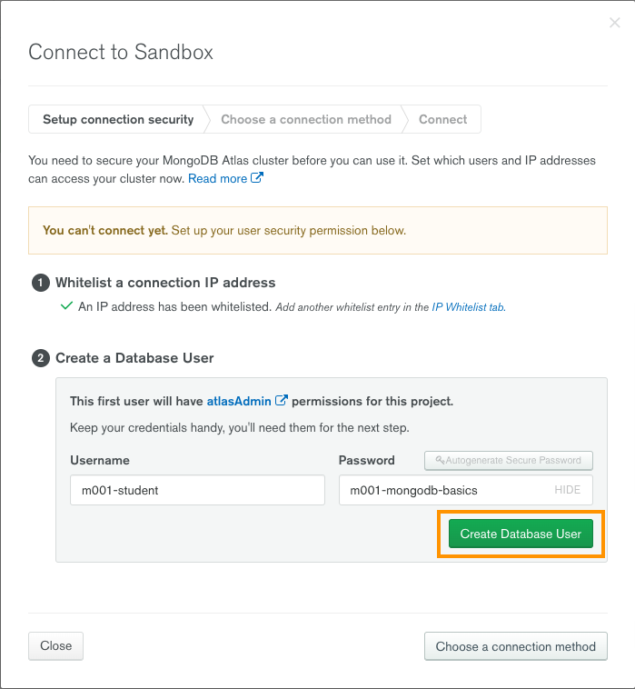

# Creating and Deploying at Atlas Cluster

[Follow this link](https://www.mongodb.com/university-signup) and select **Sign in** at the bottom right corner if you have an account, else create a new account.

 

**The following 10 easy steps will guide you in creating :**

-   an Atlas Organization named `MDBU`
-   a Project within `MDBU` called `M001`
-   a Free Tier Atlas cluster named `Sandbox`

1. Select **Create an Organization** If you already have an organization, create a [new organization from this menu](https://cloud.mongodb.com/v2#/preferences/organizations)
   
2. Name your Organization `MDBU`. Make sure that your cloud service is Atlas, then hit **Next**.
   
3. Hit **Create Organization**
   
4. Hit **New Project**
   
5. Name your Project `M001` and hit **Next**
   
6. Select **Create Project**
   
7. Select **Build a Database**
   
8. Select the right-most option that is **FREE** and hit **Create**
   
9. Select the region that is geographically closest to your location. On the bottom of the page change the cluster name to `Sandbox`. Create the cluster. This step might take a minute or two to complete.
   
10. Now that you have an Atlas cluster you need to grant access to your IP Address and create a Database User.
    - Select **Connect** from the cluster view.
      
    - Select the right-most option **Allow Access from Anywhere** and confirm your selection by clicking on **Add IP Address**. Allowing access from anywhere is **not\* a good security practice. Clusters that are used for production should \*\*not** have this enabled.
      
    - Create a Database User
        - username: `m001-student`
        - password: `m001-mongodb-basics`
          Click on **Create Database User**
          
    - **Close** the Connection menu at the lower left corner of the window.
      

**Load the Sample Dataset**
 

Select the **"…"** option in the cluster menu -> choose the **"Load Sample Dataset"** option, then confirm your choice.

When the dataset is loaded the graph labeled **"Logical Size"** on the right side of the screen should go up and display the size of the dataset that is above zero and below 512 MB. Your graph may look different than the picture below.

