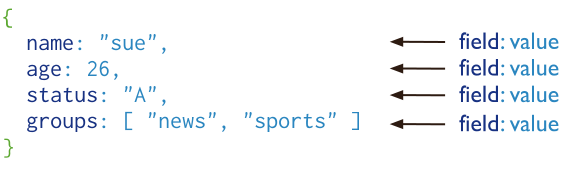

# Contents

- [Contents](#contents)
- [Introduction to MongoDB](#introduction-to-mongodb)
  - [Document Database](#document-database)
  - [Collections/Views/On-Demand Materialized Views](#collectionsviewson-demand-materialized-views)
- [Key Features](#key-features)
  - [High Performance](#high-performance)
  - [Query API](#query-api)
  - [High Availability](#high-availability)
  - [Horizontal Scalability](#horizontal-scalability)
  - [Support for Multiple Storage Engines](#support-for-multiple-storage-engines)

# Introduction to MongoDB

## Document Database

A record in MongoDB is a document, which is a data structure composed of field and value pairs. MongoDB documents are similar to JSON objects. The values of fields may include other documents, arrays, and arrays of documents.

The advantages of using documents are:

-   Documents correspond to native data types in many programming languages.
-   Embedded documents and arrays reduce need for expensive joins.
-   Dynamic schema supports fluent polymorphism.

## Collections/Views/On-Demand Materialized Views

MongoDB stores documents in collections. Collections are analogous to tables in relational databases.

In addition to collections, MongoDB supports:

-   **Read-only Views** (Starting in MongoDB 3.4)
-   **On-Demand Materialized Views** (Starting in MongoDB 4.2).

# Key Features

## High Performance

MongoDB provides high performance data persistence. In particular,

-   Support for **embedded data models** reduces I/O activity on database system.
-   **Indexes** support faster queries and can include keys from embedded documents and arrays.

## Query API

The MongoDB Query API supports read and write operations (CRUD) as well as:

-   **Data Aggregation**
-   **Text Search and Geospatial Queries.**

## High Availability

MongoDB's replication facility, called **replica set**, provides:

-   **automatic failover**
-   **data redundancy.**

A **replica set** is a group of MongoDB servers that maintain the same data set, providing redundancy and increasing data availability.

## Horizontal Scalability

MongoDB provides horizontal scalability as part of its core functionality:

-   **Sharding** distributes data across a cluster of machines.
-   Starting in 3.4, MongoDB supports creating **zones** of data based on the **shard key**. In a balanced cluster, MongoDB directs reads and writes covered by a zone only to those shards inside the zone.

## Support for Multiple Storage Engines

MongoDB supports multiple storage engines:

-   **WiredTiger Storage Engine** (including support for Encryption at Rest)
-   **In-Memory Storage Engine.**

In addition, MongoDB provides **pluggable storage engine API** that allows third parties to develop storage engines for MongoDB.
