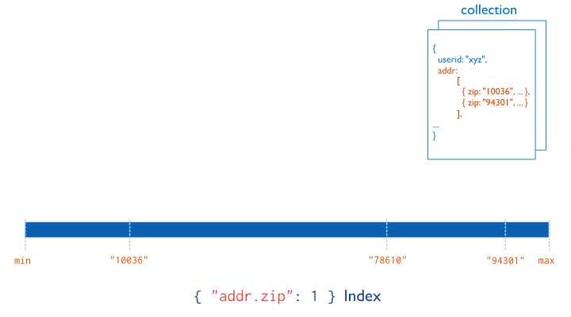

# Contents

- [Contents](#contents)
- [Indexes](#indexes)
  - [Default `_id` Index](#default-_id-index)
  - [Create an Index](#create-an-index)
    - [Index Names](#index-names)
  - [Index Types](#index-types)
    - [Single Field](#single-field)
    - [Compound Index](#compound-index)
    - [Multikey index](#multikey-index)
    - [Geospatial Index](#geospatial-index)
    - [Text Indexes](#text-indexes)
    - [Hashed Indexes](#hashed-indexes)
    - [Clustered Indexes](#clustered-indexes)
  - [Index Properties](#index-properties)
    - [Unique Indexes](#unique-indexes)
    - [Partial Indexes](#partial-indexes)
    - [Sparse Indexes](#sparse-indexes)
    - [TTL Indexes](#ttl-indexes)
    - [Hidden Indexes](#hidden-indexes)

# Indexes

Indexes support the efficient execution of queries in MongoDB. Without indexes, MongoDB must perform a collection scan, i.e. scan every document in a collection, to select those documents that match the query statement. If an appropriate index exists for a query, MongoDB can use the index to limit the number of documents it must inspect.

Indexes are special data structures (MongoDB indexes use a B-tree data structure.) that store a small portion of the collection's data set in an easy to traverse form. The index stores the value of a specific field or set of fields, ordered by the value of the field. The ordering of the index entries supports efficient equality matches and range-based query operations. In addition, MongoDB can return sorted results by using the ordering in the index.

The following diagram illustrates a query that selects and orders the matching documents using an index:


Fundamentally, indexes in MongoDB are similar to indexes in other database systems. MongoDB defines indexes at the collection level and supports indexes on any field or sub-field of the documents in a MongoDB collection.

## Default `_id` Index

MongoDB creates a unique index on the `_id` field during the creation of a collection. The `_id` index prevents clients from inserting two documents with the same value for the `_id` field. You cannot drop this index on the `_id` field.

## Create an Index

To create an index in the Mongo Shell, use `db.collection.createIndex()`.

```
db.collection.createIndex( <key and index type specification>, <options> )
```

The following example creates a single key descending index on the name field:

```
db.collection.createIndex( { name: -1 } )
```

The `db.collection.createIndex()` method only creates an index if an index of the same specification does not already exist.

### Index Names

The default name for an index is the concatenation of the indexed keys and each key's direction in the index ( i.e. 1 or -1) using underscores as a separator. For example, an index created on `{ item : 1, quantity: -1 }` has the name `item_1_quantity_-1`.

You can create indexes with a custom name, such as one that is more human-readable than the default. For example, consider an application that frequently queries the products collection to populate data on existing inventory. The following `createIndex()` method creates an index on item and quantity named query for inventory:

```
db.products.createIndex(
    { item: 1, quantity: -1 },
    { name: "query for inventory" }
)
```

You can view index names using the `db.collection.getIndexes()` method. You cannot rename an index once created. Instead, you must drop and re-create the index with a new name.

## Index Types

MongoDB provides a number of different index types to support specific types of data and queries.

### Single Field

In addition to the MongoDB-defined `_id` index, MongoDB supports the creation of user-defined ascending/descending indexes on a **single field of a document**.


For a single-field index and sort operations, the sort order (i.e. ascending or descending) of the index key does not matter because MongoDB can traverse the index in either direction.

### Compound Index

MongoDB also supports user-defined indexes on multiple fields, i.e. **compound indexes**.

The order of fields listed in a compound index has significance. For instance, if a compound index consists of `{ userid: 1, score: -1 }`, the index sorts first by `userid` and then, within each `userid` value, sorts by `score`.


For compound indexes and sort operations, the sort order (i.e. ascending or descending) of the index keys can determine whether the index can support a sort operation.

### Multikey index

MongoDB uses multikey indexes **to index the content stored in arrays**. If you index a field that holds an array value, MongoDB creates separate index entries for every element of the array. These multikey indexes allow queries to select documents that contain arrays by matching on element or elements of the arrays.
MongoDB automatically determines whether to create a multikey index if the indexed field contains an array value; you do not need to explicitly specify the multikey type.



### Geospatial Index

To support efficient queries of geospatial coordinate data, MongoDB provides two special indexes: **2d indexes** that uses planar geometry when returning results and **2dsphere indexes** that use spherical geometry to return results.

### Text Indexes

MongoDB provides a text index type that supports searching for string content in a collection.
These text indexes do not store language-specific stop words (e.g. "the", "a", "or") and stem the words in a collection to only store root words.

### Hashed Indexes

To support **hash based sharding**, MongoDB provides a hashed index type, which indexes the hash of the value of a field. These indexes have a more random distribution of values along their range, but only support equality matches and cannot support range-based queries.

### Clustered Indexes

Starting in MongoDB 5.3, you can create a collection with a **clustered index**. Collections created with a clustered index are called clustered collections.

## Index Properties

### Unique Indexes

The unique property for an index causes MongoDB to reject duplicate values for the indexed field. Other than the unique constraint, unique indexes are functionally interchangeable with other MongoDB indexes.

### Partial Indexes

Partial indexes only index the documents in a collection that meet a specified filter expression. By indexing a subset of the documents in a collection, partial indexes have **lower storage requirements** and **reduced performance costs** for index creation and maintenance.

Partial indexes offer a superset of the functionality of sparse indexes and should be preferred over sparse indexes.

### Sparse Indexes

The sparse property of an index ensures that the index only contain entries for documents that have the indexed field. The index skips documents that do not have the indexed field.

You can combine the sparse index option with the unique index option to prevent inserting documents that have duplicate values for the indexed field(s) and skip indexing documents that lack the indexed field(s).

### TTL Indexes

TTL indexes are special indexes that MongoDB can use to automatically remove documents from a collection after a certain amount of time. This is ideal for certain types of information like machine generated event data, logs, and session information that only need to persist in a database for a finite amount of time.

### Hidden Indexes

Hidden indexes are not visible to the query planner and cannot be used to support a query.

By hiding an index from the planner, users can evaluate the potential impact of dropping an index without actually dropping the index. If the impact is negative, the user can unhide the index instead of having to recreate a dropped index. And because indexes are fully maintained while hidden, the indexes are immediately available for use once unhidden.

Except for the `_id` index, you can hide any indexes.
