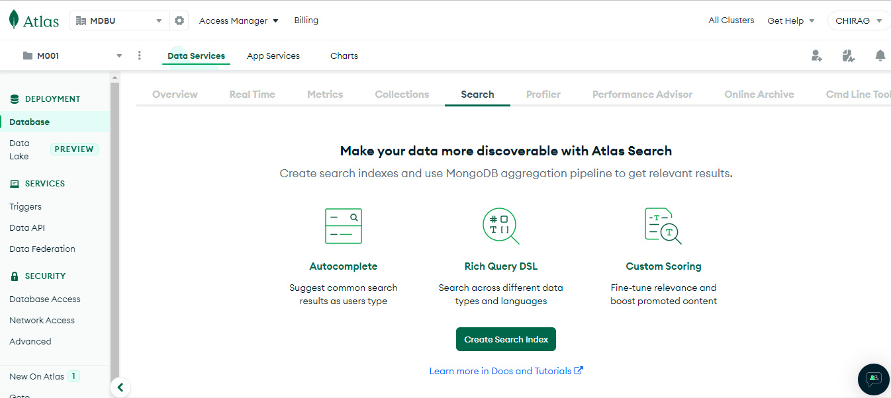
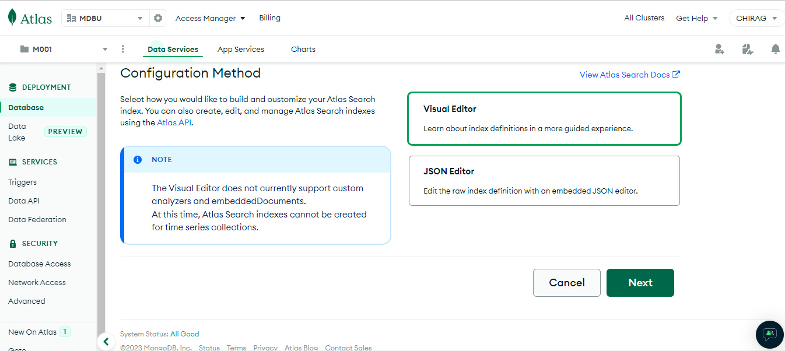
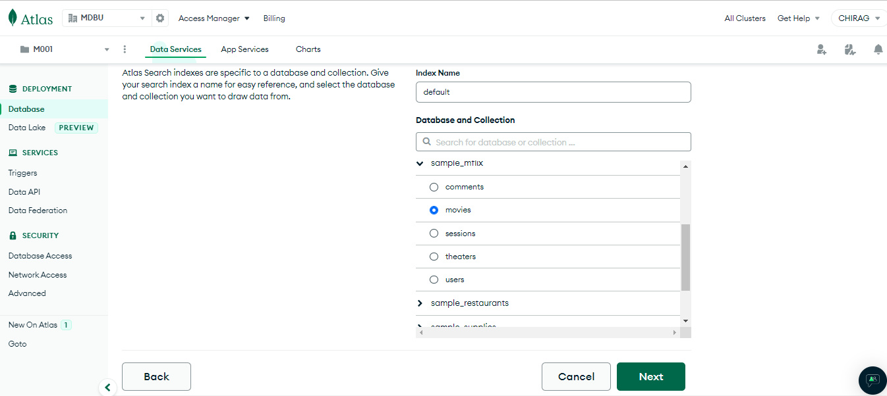
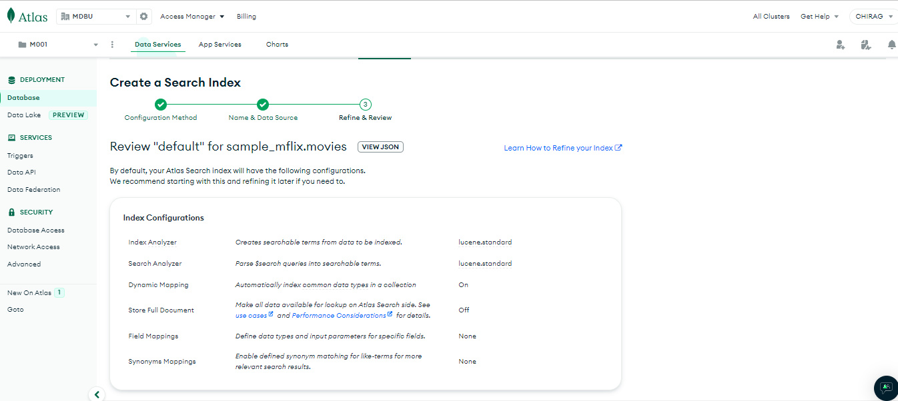
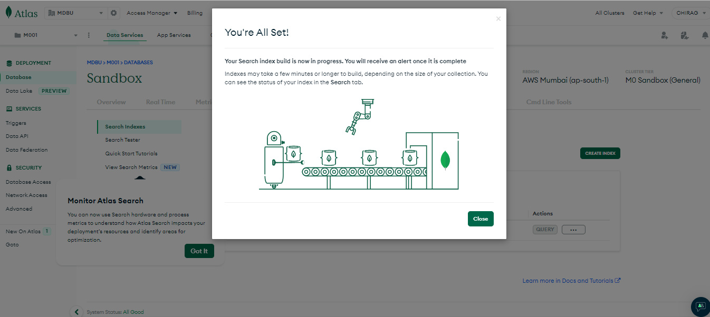
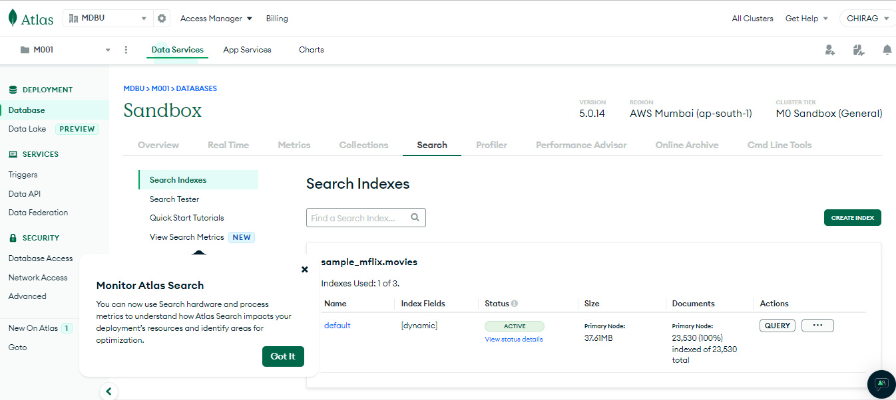

# Relevance Based Search

**Relevance Based Search** is a search used when an application end user seeks to surface records based on a search term.

**It's not a database search for a particular record.**

For example, you go to google and search for MongoDB Atlas Search, this is relevance based search.

# Atlas Search

Atlas Search is an embedded full-text search (**[relevance based search](#relevance-based-search)**) in MongoDB Atlas that gives you a seamless, scalable experience for building relevance-based app features. Built on **Apache Lucene**(an open source search algorithm), Atlas Search eliminates the need to run a separate search system alongside your database.

Atlas Search starts with **Search Indexes**, which are used to specify how the search algorithm should work with this set of data.

**Note: Search Indexes are NOT the same as Database Indexes.**

-   **Database Indexes** are used by developers and database administrators to make their frequent database queries easier and more efficient.
-   **Search Indexes** are used to specify how records are referenced for relevance-based search. The components of a **Search Index** includes information about **analyzers** that are being used (in most cases `lucene.standard`), the **type of mapping** (either `dynamic` or `static`), an **option to store whole documents in memory for faster post-aggregation performance**, and **field mappings**.

# Creating Atlas Search Index

You can create an Atlas Search index using the **Atlas UI**, **Atlas Search API**, or **Atlas CLI**.
We will be using **Atlas UI**.

## Atlas UI

1. Navigate to the **Atlas Search page** for your project.
    - If it is not already displayed, select the organization that contains your desired project from the **Organizations** menu in the navigation bar.
    - If it is not already displayed, select your desired **project** from the Projects menu in the navigation bar.
    - Click your cluster's name.
    - Click the **Search** tab.
      
2. Click **Create Search Index**.
3. Select a Configuration Method and click **Next**.
    - For a guided experience, select **Visual Editor**.
    - To edit the raw index definition, select **JSON Editor**.
      
4. Enter the **Index Name**, and set the **Database** and **Collection**.

    - In the **Index Name** field, enter `default`.
    - **Note :** If you name your index `default`, you don't need to specify an index parameter when using the `$search` pipeline stage. Otherwise, you must specify the index name using the index parameter.
    - In the **Database and Collection** section, find the `sample_mflix` database, and select the `movies` collection.
      

5. Specify an index definition. - You can create an Atlas Search index that uses **dynamic mappings** or **static mappings**. - **Dynamic Search** is for a dynamic search that looks through all of the fields for the user search term. - Since, we are looking at dynamic mapping, we will not have to give **Field mappings** here.
     - The following index definition dynamically indexes the fields of supported types in the movies collection. You can use the **Visual Editor** or the **JSON Editor** in the Atlas user interface to create the index.
     - **Visual Editor** - Click **Next**. - Review the `"default"` index definition for the `movies` collection.
    - **JSON Editor** - Click **Next**. - Review the index definition.
   Your index definition should look similar to the following:
   `      {
    "mappings": {
        "dynamic": true
    }
}`
   The above index definition dynamically indexes the fields of supported types in each document in the movies collection. - Click **Next**.
6. Click **Create Search Index**.
7. Close the You're All Set! Modal Window.
   A modal window appears to let you know your index is building. Click the **Close** button.
   
8. Wait for the index to finish building.
   The index should take about one minute to build. While it is building, the **Status** column reads `Build in Progress`. When it is finished building, the **Status** column reads `Active`.
   
